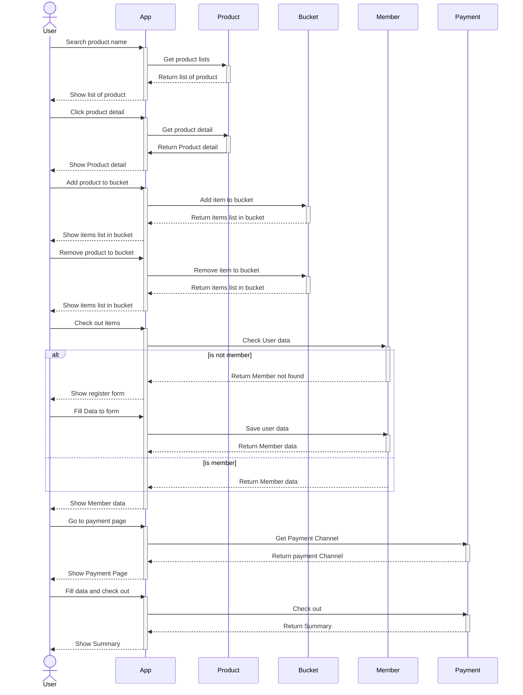

# Assignments for Java Boot Camp
* [Week 1 :: Design and Develop RESTful API with Spring Boot](https://github.com/up1/assignment-java-boot-camp/wiki/Week-01)

## API Endpoint List (In progress)
|Endpoint|Method|Description|Example JSON valid|Example JSON invalid|
|-|-|-|-|-|
|[/member/register](https://github.com/K-dotdev/assignment-java-boot-camp/wiki/Member-API#sign-up)|POST|Register Member|[JSON](https://github.com/K-dotdev/assignment-java-boot-camp/wiki/Member-API#response-valid)|[JSON](https://github.com/K-dotdev/assignment-java-boot-camp/wiki/Member-API#response-invalid)|
|[/member/login](https://github.com/K-dotdev/assignment-java-boot-camp/wiki/Member-API#sign-in)|POST|Login member|||
|[/product/list/:seachtext](https://github.com/K-dotdev/assignment-java-boot-camp/wiki/Product-API#product-list)|GET|Get product list by text|[JSON](https://github.com/K-dotdev/assignment-java-boot-camp/wiki/Product-API#response-valid)|[JSON](https://github.com/K-dotdev/assignment-java-boot-camp/wiki/Product-API#response-invalid)|
|[/product/:id](https://github.com/K-dotdev/assignment-java-boot-camp/wiki/Product-API#product-detail)|GET|Get product detail|[JSON](https://github.com/K-dotdev/assignment-java-boot-camp/wiki/Product-API#response-valid-1)|[JSON](https://github.com/K-dotdev/assignment-java-boot-camp/wiki/Product-API#response-invalid-1)|
|/bucket/add|POST|Create product bucket|||
|/bucket/:id|GET|Get product in bucket|||
|/bucket/:id|PUT|Add product to bucket|||
|/bucket/:id|DELETE|Delete product in bucket|||
|/payment/channel|GET|Get payment channel in list|||
|/payment/checkout|POST|Checkout with payment info|||
|/payment/:id/summary|GET|Get payment summary by bucket|||

## Flow

## Sequence Diagram for Shopping

