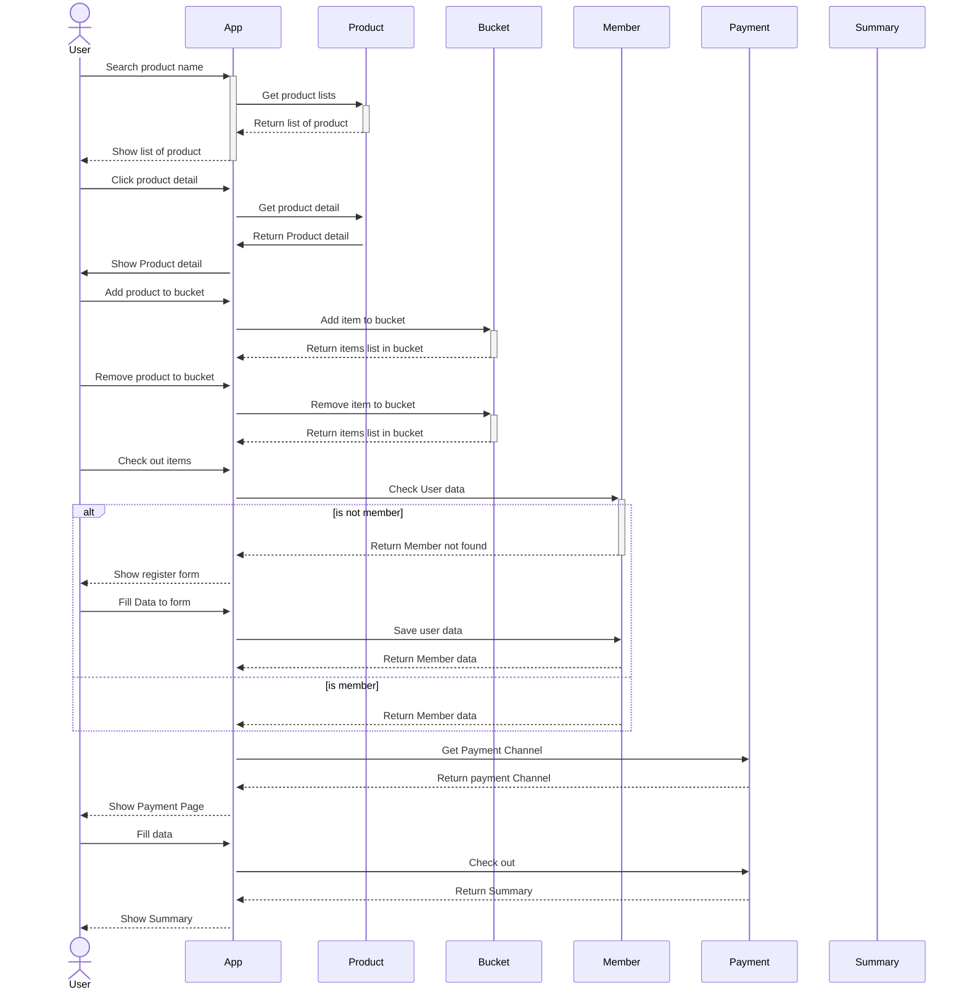

## Assignments for Java Boot Camp
* [Week 1 :: Design and Develop RESTful API with Spring Boot](https://github.com/up1/assignment-java-boot-camp/wiki/Week-01)

#How to run test

#Sequence Diagram for Shopping

#API Endpoint List
